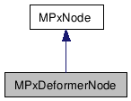
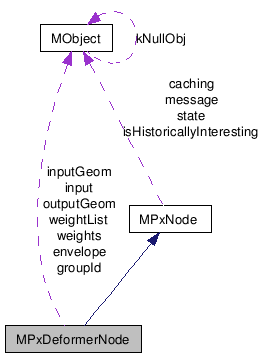

# Notes on Maya API 01
* Date: 2020/8/1

**Making Maya `.mll` plug-ins**
By folowing the turial [here at CG Circuit](https://www.cgcircuit.com/tutorial/introduction-to-the-maya-api)

|Tasks:|
|---|
|* Using Visual Studio |
|* Using Cmake |

* Date: 2020/8/4
**For building Maya plug-in on windows using CMake**
* using cmake: the command line should be something like this, which works on my machine:

|`cmake -G "Visual Studio 16 2019" ../src` | `(cmakelist is under the same directory with source files)` |
|:---|---|
|if want to build a different version of Maya plug-in, the cmd lines should be like this, adding an extra flag `-D` to override the maya versions: | |
| **`cmake -G "Visual Studio 16 2019" -D MAYA_VERSION:string=2018 ../src`**| |
| Then click on the `project_name.sln` file and build from `visual studio 2019`||


* Loading plug-in:
  1. `Maya` &rarr; `windows` &rarr; `settings/preferences` &rarr; `Plug-in Manager`
  2. Browse where the mll lib is located then load.

  ||
  | :---:|
  |[image-source-link: knowledge.autodesk.com/support/](https://knowledge.autodesk.com/support/maya/troubleshooting/caas/sfdcarticles/sfdcarticles/Arnold-is-not-showing-up-as-renderer-in-Maya-2017-without-error-messages.html)|

-------

* **Maya Dependency Graph**


Here are some diagrams I found on the internet. The mechanisms are indicated in the second diagram (reference: [Chad Vernon, The Maya Dependency Graph](https://www.chadvernon.com/maya-api-programming/the-maya-dependency-graph/)) pretty clearly.


There is also a documentation of Maya quotes:


 > The dependency graph (DG) is a collection of entities connected together. Unlike the DAG, these connections can be cyclic, and do not represent a parenting relationship. Instead, the connections in the graph allow data to move from one entity in the graph to another. The entities in the graph which accept input, perform computations, and output new data, are called dependency graph nodes. Dependency graph nodes are used for almost everything in Maya such as model creation, deformation, animation, simulation, and audio processing. 
 > * diagram:
 > 
 > **Reference: [Autodesk Maya 2018 - About the dependency graph](http://help.autodesk.com/view/MAYAUL/2018/ENU//?guid=__files_Dependency_graph_plugins_Dependency_Graph_DG_nodes_htm)**

------

* **Maya API Basics** &rarr; [Maya API refenrece](http://help.autodesk.com/view/MAYAUL/2017/ENU/?guid=__cpp_ref_classes_html)

  * **MObject**
    1. A Handle Object (in creator functions set it to a `void ptr`) pointing to data in Maya
    2. Maya _maintains ownership_
    3. Typeless (`void*`, `MObject` can represent anytype, it can be: i.g. `SkinCluster`, `Mesh`, `BlendShape`, `IK_Solver`, etc. )
  * **Function Set**
    1. Always work with `MObjects`
    2. Owned by the developer(you)

  * **Wrappers**
    1. Convenient classes(arrays, map class(quaternions, planes, vectors, matrix math..))
    2. allocation/deallocations automatically

  * **Proxies**
    1. base class(or templates)to create new type of Maya objects
    2. Create by you but owned by maya


* example code:

`#1`
```
MObject iMesh = getMeshObject("polyShape1");

//Here test to see if it is Nurbs
if(iMesh.hasFn(MFn::kNurbsSurface))
{
  //returns false
}

if(iMesh.HasFn(MFn::kMesh))
{
  MStatus status;
  MfnMesh fnMesh(iMesh, &status);
  CHECK_MSTATUS_AND_RETURN_IT(status);
  //here just checking if this object indeed has a kmesh function

  //Getting the mesh points from this object
  MPointArray points;
  fnMesh.getPoints(points)
}

```
`#2`

**diagram 1** 
**diagram 2** 


```
#include <maya/MFnNurbsCurve.h>
#include <maya/MFnSubd.h>
#include <maya/MFnData.h>

class myShapeLayer : public MPxDeformerNode
{
public:
  myShapeLayer();
  virtual ~myShapeLayer();
  virtual MStatus deform(
                        MDataBlock& data,
                        MItGemetry& itGeo,
                        const MMatrix& localToWorldMatrix,
                        size_t geomIndex
                        );
static void* creator();
static MStatus initialize();

//**public static variable field

//**protected variable field

..

}
```
